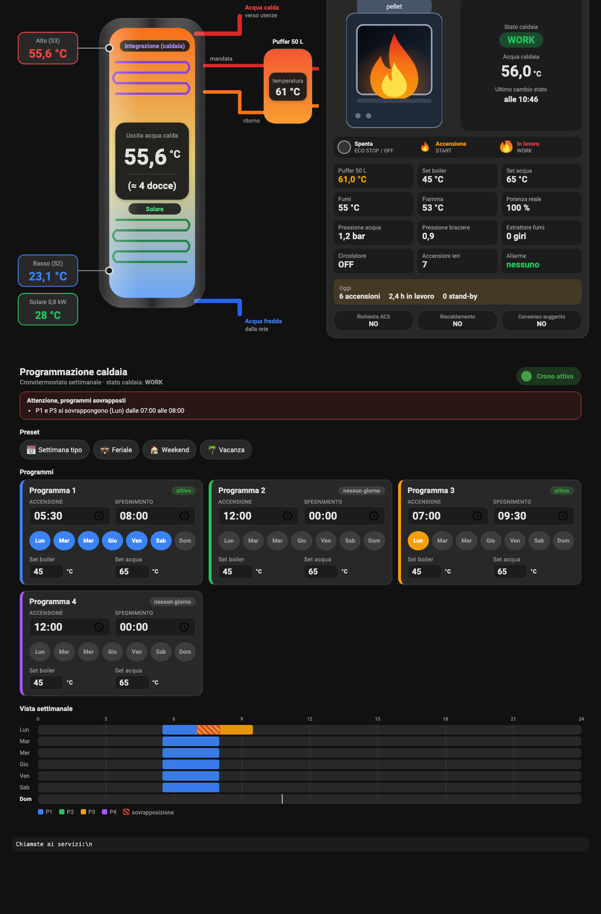
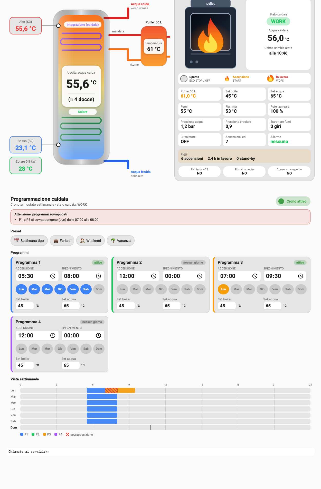

# Impianto riscaldamento dashboard

Due schede Lovelace per Home Assistant, pensate per un impianto con **boiler solare**, **puffer** e
**caldaia a pellet Micronova (Nobis Polygon)** letta dall'integrazione
[`aguaiot_hubcasale`](https://github.com/hubcasale/home_assistant_micronova_agua_iot_hubcasale):

| Scheda | Cosa fa |
|---|---|
| `impianto-overview-card` | Il boiler solare con temperatura alta e bassa, acqua in uscita e docce stimate; il puffer; la caldaia con fiamma piccola (accensione) o grande (in lavoro), stato, temperature, pressioni, contatori del giorno e le richieste del sistema di suggerimento. |
| `caldaia-schedule-card` | La programmazione settimanale della caldaia: 4 programmi con orari, giorni e set di temperatura, **vista settimanale a barre**, **avviso di sovrapposizione** e **preset** (feriale, weekend, vacanza…) con un tocco. |

Funzionano sia su tema chiaro che scuro (usano i colori del tema di Home Assistant) e si adattano al telefono.




> Gli screenshot vengono dal banco di prova (`dev/index.html`) con dati di esempio.
> Il lunedì P1 e P3 si sovrappongono apposta, per mostrare l'avviso.

## Installazione

### HACS (repository personalizzato)

1. HACS → menu a tre punti → **Repository personalizzati** → incolla
   `https://github.com/hubcasale/impianto-riscaldamento-dashboard`, categoria **Dashboard**.
2. Installa **Impianto riscaldamento dashboard**.
3. Aggiungi le schede a una dashboard (vedi `examples/dashboard.yaml`).

### A mano

1. Copia `dist/impianto-riscaldamento-dashboard.js` in `<config>/www/`.
2. Impostazioni → Dashboard → Risorse → aggiungi `/local/impianto-riscaldamento-dashboard.js` come **Modulo JavaScript**.
3. Ricarica la dashboard.

## `impianto-overview-card`

```yaml
type: custom:impianto-overview-card
title: Impianto acqua calda      # facoltativo
```

Senza altro usa questi nomi di entità (cambiali in `entities:` se i tuoi sono diversi):

| Chiave | Entità predefinita | Da dove viene |
|---|---|---|
| `boiler_top` | `sensor.boiler_solare_alto_stimato` | `ha-packages/boiler_solare.yaml` |
| `boiler_bottom` | `sensor.boiler_solare_basso_stimato` | idem |
| `outlet` | *(assente: si usa la sonda alta)* | temperatura dell'acqua in uscita, se la misuri |
| `solar_power`, `collector_temp` | `sensor.solare_termico_potenza`, `sensor.solare_termico_t_collettore_stimata` | pacchetto solare termico |
| `puffer`, `stove_state`, `stove_water`, `smoke`, `flame`, `power`, `water_pressure`, `brazier_pressure`, `extractor`, `pump`, `alarm` | `sensor.casale_*` | integrazione `aguaiot_hubcasale` |
| `set_boiler`, `set_water` | `number.casale_setpoint_boiler`, `climate.casale_acqua` (attributo `temperature`) | integrazione |
| `starts_today`, `starts_yesterday`, `standby_today`, `work_hours_today` | `sensor.caldaia_*` | `ha-packages/caldaia_suggerimento.yaml` |
| `request_acs`, `request_heating`, `consent` | `binary_sensor.caldaia_richiesta_acs` … | idem |

Il numero di **docce** si calcola con un modello a due zone: la parte alta del serbatoio (quota `top_share`)
è alla temperatura della sonda alta, il resto a quella della sonda bassa; ogni zona sopra la temperatura
della doccia dà `litri × (T − T_rete) / (T_doccia − T_rete)`. Parametri (numero o id di entità):

```yaml
model:
  volume: 190          # litri utili (predefinito: input_number.boiler_solare_volume)
  top_share: 50        # % di volume della zona alta (predefinito: input_number.boiler_solare_peso_alto)
  mains_temp: 15       # °C acqua di rete (predefinito: input_number.boiler_solare_t_rete)
  shower_volume: 40    # litri per doccia
  shower_temp: 38      # °C della doccia
```

Sotto i 560 px di larghezza il disegno del boiler perde il puffer (resta nelle tessere) per restare leggibile.

## `caldaia-schedule-card`

```yaml
type: custom:caldaia-schedule-card
title: Programmazione caldaia     # facoltativo
prefix: casale                    # prefisso delle entità dell'integrazione
hide: [weekly]                    # facoltativo: nasconde "weekly" e/o "presets"
```

Usa le entità create dall'integrazione, per ogni programma N da 1 a 4:
`time.casale_crono_pN_accensione`, `time.casale_crono_pN_spegnimento`,
`number.casale_crono_pN_setpoint_boiler`, `number.casale_crono_pN_setpoint_acqua`,
`switch.casale_crono_pN_<giorno>` (lunedi … domenica) e l'interruttore generale
`switch.casale_cronotermostato_settimanale`.

- **Orari a passi di 10 minuti** (come la caldaia). Spegnimento `00:00` = fino a mezzanotte.
- **Sovrapposizioni**: se due programmi attivi si incrociano nello stesso giorno compare un avviso in alto e la
  fascia è tratteggiata in rosso nella vista settimanale. Fasce che si toccano soltanto non contano; un programma
  che scavalca la mezzanotte occupa anche il giorno dopo.
- **Vista settimanale**: una riga per giorno, con la linea dell'ora attuale.
- Le modifiche sono scritte subito. I campi si attenuano finché la caldaia non conferma (passa dal cloud, può
  servire qualche minuto).

### Preset

Quattro preset predefiniti: *Settimana tipo*, *Feriale*, *Weekend*, *Vacanza*. Toccando un preset la scheda
mostra **che cosa cambierebbe** e chiede conferma; applica solo le differenze. Si possono sostituire:

```yaml
presets:
  - name: Mattina e sera
    icon: mdi:weather-sunset
    description: Dalle 5:30 alle 8 e dalle 17 alle 22:30
    crono: true                 # true/false = attiva/disattiva il cronotermostato; assente = non toccarlo
    programs:
      "1": { on: "05:30", off: "08:00", days: [lun, mar, mer, gio, ven, sab, dom], set_boiler: 45, set_water: 65 }
      "2": { on: "17:00", off: "22:30", days: [lun, mar, mer, gio, ven, sab, dom] }
      "3": null                 # null (o days: []) = programma disattivato
      # "4" non elencato = resta com'è
```

I giorni si scrivono in italiano o inglese, corti o lunghi (`lun`, `mon`, `lunedì`…).

## Pacchetti di Home Assistant e ESPHome

Le schede leggono sensori che qui sono forniti come esempio:

- `ha-packages/boiler_solare.yaml`: temperature stimate alta e bassa (con una correzione provvisoria rispetto alla centralina
  solare), media, stratificazione, energia accumulata e acqua calda equivalente.
- `ha-packages/caldaia_suggerimento.yaml`: suggerimento informativo di accendere o no la caldaia, contatori di
  accensioni e ore in lavoro. **Non comanda niente.**
- `esphome/solare-termico.yaml`: ESP32 con ADS1115 e sonde NTC 10k B3950 (serpentine) e due sonde sul boiler.

## Sviluppo

```bash
npm install
npm test            # prove della logica (programmazione, sovrapposizioni, preset, docce)
npm run typecheck
npm run build       # dist/impianto-riscaldamento-dashboard.js (da pubblicare nel repository)
npm run build:dev   # dev/bundle.js, poi apri dev/index.html nel browser
```

`dev/index.html` è un banco di prova con una finta Home Assistant (stati e servizi simulati):
`?tema=chiaro|scuro`, `?stato=WORK|START|ECO STOP|STAND BY`, `?larghezza=380`.

## Cose da sapere / limiti

- La scrittura dei **giorni** e degli **orari** passa dal cloud Micronova: va provata sulla propria caldaia
  (conviene su un programma libero, con il cronotermostato spento).
- La stima delle **docce** e le temperature "stimate" dipendono dalla taratura delle sonde.
- Niente editor visivo per ora: la configurazione è in YAML.

## Licenza

MIT
