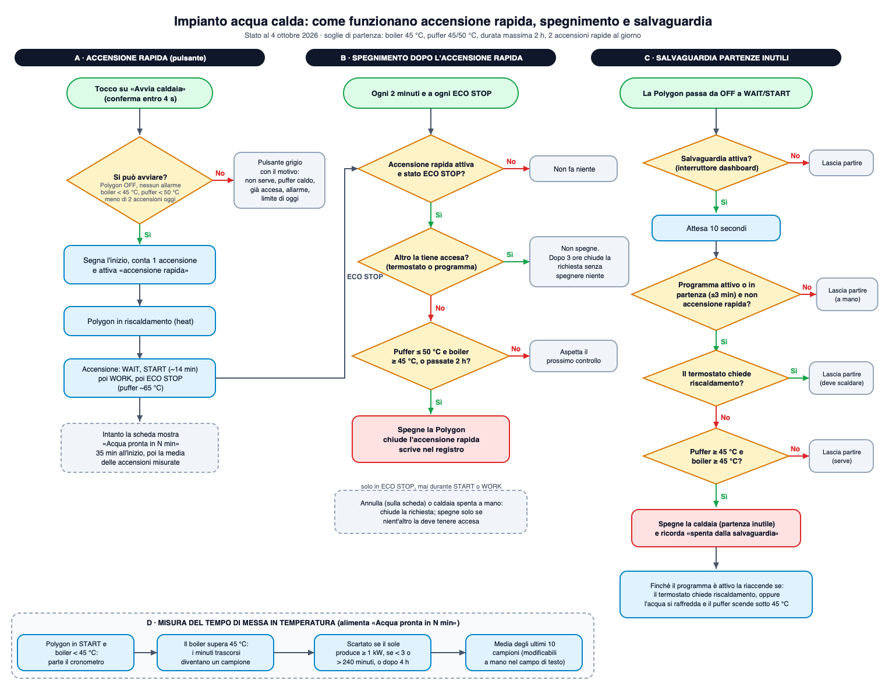
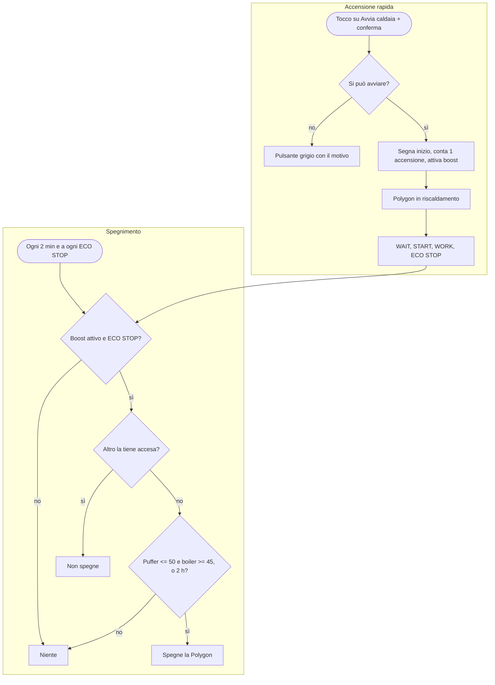
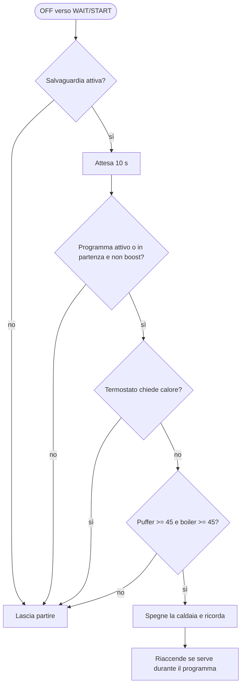

# Memoria del progetto: impianto acqua calda

Ultimo aggiornamento: **4 ottobre 2026**. Scopo di questo file: ricordare com'è fatto l'impianto, che cosa fa ogni pezzo
del sistema, quali scelte sono state fatte e perché, e che cosa resta da verificare. Il diagramma di flusso è in
`docs/funzionamento.png` (sorgente `docs/funzionamento.svg`, generato da `docs/genera_diagramma.py`).

---

## 1. L'impianto

- **Boiler solare** Cordivari Bolly 2, targhetta 200 L (serbatoio utile circa **189-190 L**), anno 2007.
  Serpentine: **inferiore solare 1,2 m²**, **superiore integrazione 0,5 m²**. Pozzetti sonde da 1/2". Classe energetica B.
- **Collettori solari**: 2 piani, 2 × 1 m² ciascuno (Ariston Kairos CF 2.0-1). Circolatore a velocità 1, circa 7 L/min.
- **Centralina solare Seitron Elios 25** (sonde PT1000): S1 collettore, S2 basso boiler, S3 alto boiler. Integrazione:
  TAH = 45 °C (chiede calore sotto 45), isteresi HYT = 10 (smette a 55), modo ECO.
- **Caldaia a pellet Nobis Polygon (Micronova)**, schema 01: scalda **solo il puffer di bilanciamento da 50 L**.
  Il calore passa al boiler tramite la serpentina di integrazione, con una pompa comandata dall'Elios.
  Comfort Clima: isteresi (delta riaccensione) 15 °C, ritardo spegnimento 3 minuti. Set boiler 45 °C, set acqua 65 °C.
- **ESP32 `solare-termico`** (in rete locale): sonde NTC 10k B3950. Boiler alto (GPIO34) e basso (GPIO35) funzionano;
  le 4 sonde delle serpentine sono sul modulo **ADS1115, che è guasto** (legge sempre -0,002 V): da sostituire.
- **Home Assistant** in Docker sul server di casa, configurazione in `.../docker/homeassistant/data`.
  Integrazione della caldaia: `aguaiot_hubcasale` (repository `hubcasale/home_assistant_micronova_agua_iot_hubcasale`).

## 2. Cose imparate dai dati (fatti, non ipotesi)

| Fatto | Dettaglio |
|---|---|
| Accensione a freddo | WAIT → START → WORK in circa **14 minuti**; il puffer passa da 31 a 65 °C in circa **26 minuti** (4/10, 06:47). |
| Acqua pronta | Dopo l'accensione, la sonda alta del boiler (corretta) supera 45 °C in circa **34 minuti** e 50 °C in circa 48 (4/10). Non serve un'ora. |
| Orologio della caldaia | Andava **13 minuti avanti** (programmi partiti 13 min prima: 05:30→05:17, 07:00→06:46, 12:00→11:47; fine 09:30→09:17). Il 4/10 l'utente l'ha allineato. |
| Programmi e puffer | Un programma accende la caldaia anche con il puffer già caldo (4/10 alle 11:47 con puffer 45 °C): da qui la salvaguardia. |
| Riaccensione da ECO STOP | Il 4/10 alle 17:13 la Polygon è ripartita da ECO STOP con acqua a 50 °C (= set acqua 65 − isteresi 15), pur con il boiler solare a 56 °C: decide solo in base alla sua acqua. |
| Raffreddamento | Il puffer da fermo perde circa 0,13 °C/min. Riaccensione di Comfort Clima osservata a circa 41-45 °C con set 45. |
| Circolatore Polygon | In ECO STOP fa impulsi di circa 1 minuto ogni 10-11 minuti; da OFF resta spento. Il registro della pompa è di sola lettura. |
| Sonde ESP32 del boiler | Leggono più basso di S3/S2 dell'Elios per contatto termico scarso: sentono in parte l'aria del garage. Correzione con modello di accoppiamento `stimata = T_ambiente + (grezza - T_ambiente) / k`, con **T_ambiente 16 °C**, **k alto 0,766**, **k basso 0,73** (5 letture di confronto, errore sotto 0,1 °C su quei punti). Il collettore stimato dal modello solare è invece già esatto (44,7 contro 44,8). |
| Polling cloud | Home Assistant legge la caldaia ogni **60 s** (opzione `update_interval`), perciò vede una partenza con fino a 60 s di ritardo. |

**Curva di taratura.** Per ogni sonda del boiler si registrano coppie (valore grezzo ESP32, lettura S3/S2 della centralina).
Con almeno 3 punti con deviazione standard di almeno 1,5 °C sulla grezza, il sistema calcola da solo la retta
`reale = a · grezza + b` (minimi quadrati, ultimi 15 punti) e la usa; con meno punti usa il modello di accoppiamento.
Punti iniziali (4/10/2026): alta `45.1:54.0, 47.2:56.8, 49.5:59.6` (a = 1,272, b = −3,32); bassa `21.4:23.4, 27.8:32.2`.

## 3. Come funziona il sistema (vedi diagramma)

**A. Accensione rapida (pulsante «Avvia caldaia»).** Funziona solo se la Polygon è **OFF**, senza allarme, con boiler
(alto, corretto) sotto 45 °C, puffer sotto 50 °C e meno di 2 accensioni rapide oggi. Il primo tocco chiede conferma (4 s).
Imposta la caldaia in riscaldamento, segna l'inizio e conta l'accensione.

**B. Spegnimento.** Ogni 2 minuti e a ogni ECO STOP: se l'accensione rapida è attiva e la caldaia è in **ECO STOP**,
e *nient'altro* la tiene accesa (termostato che chiede calore, programma attivo adesso), la **spegne** quando il puffer
scende a 50 °C con il boiler a 45 °C o più, oppure dopo 2 ore. Non spegne mai in START o WORK. Dopo 3 ore chiude la
richiesta senza spegnere. «Annulla» o spegnimento a mano chiudono la richiesta.

**C. Salvaguardia partenze inutili.** Quando la Polygon passa da OFF **o da ECO STOP** a WAIT/START (programma che parte, oppure riaccensione di Comfort Clima quando l'acqua della caldaia scende sotto set acqua meno isteresi, es. 65 − 15 = 50 °C), dopo **10 secondi** controlla: è un
programma attivo o in partenza (±3 min), non un'accensione a mano o col pulsante? Il termostato non chiede calore?
Puffer ≥ 45 °C e boiler ≥ 45 °C? Se sì, spegne la caldaia (partenza inutile). Finché il programma è attivo la
**riaccende** se il termostato chiede riscaldamento o se l'acqua si raffredda con il puffer sotto 45 °C.
Si disattiva con l'interruttore «Evita partenze inutili» nella scheda.

**D. Tempo di messa in temperatura.** Misura i minuti tra START (boiler sotto 45 °C) e il superamento di 45 °C;
scarta le misure con sole ≥ 1 kW, sotto 3 o sopra 240 minuti, o oltre 4 ore. Media degli ultimi 10 campioni
(modificabili a mano). Parte da 35 minuti finché ci sono meno di 3 campioni. Alimenta «Acqua pronta in N min».

### Versione testuale (Mermaid)

## 4. Entità principali

| Che cosa | Entità |
|---|---|
| Boiler alto / basso, grezzi (ESP32) | `sensor.solare_termico_boiler_alto`, `sensor.garage_solare_termico_boiler_basso` |
| Boiler alto / basso, corretti (S3 / S2) | `sensor.boiler_solare_alto_stimato`, `sensor.boiler_solare_basso_stimato` |
| Media, stratificazione, energia, acqua equivalente | `sensor.boiler_solare_temperatura_media`, `..._stratificazione`, `..._energia_accumulata`, `..._acqua_calda_equivalente` |
| Sonde nuove (7/10/2026) | Sonde ESP32 più piccole su S3 e S2: k = 1, correzione fissa +4 °C (S3 della centralina sopra la sonda alta) e +3 °C (S2 sopra la bassa), punti di taratura azzerati (automazione v5 in `boiler_solare.yaml`). Letture di conferma: alto 50,1 → 54,1 °C, basso 20,4 → 23,4 °C. Per affinare, registrare nuovi punti con la scheda di taratura a temperature diverse. |
| Curva di taratura (si adatta da sola) | `sensor.boiler_solare_curva_sonda_alta` / `..._bassa` (attributi `a`, `b`, `punti`), `input_text.boiler_cal_punti_alto` / `..._basso`, `input_number.boiler_cal_s3` / `..._s2`, script `boiler_cal_registra_*` e `boiler_cal_annulla_*` (scheda: `examples/taratura.yaml`) |
| Modello di partenza (usato con meno di 3 punti) | `input_number.boiler_solare_t_ambiente` (16), `..._k_alto` (0,766), `..._k_basso` (0,73); `..._delta_alto` / `..._delta_basso` (0) per ritocchi fini |
| Stato e puffer della Polygon | `sensor.casale_stato`, `sensor.casale_temperatura_boiler` (= puffer da 50 L), `sensor.casale_temperatura_acqua` |
| Accensione / spegnimento | `climate.casale_acqua` (heat / off) |
| Consumo di pellet (stima) | `ha-packages/caldaia_pellet.yaml`: `sensor.caldaia_pellet_consumo_istantaneo` (kg/h da stato e potenza reale), integrazione + grammi per accensione = `sensor.caldaia_pellet_stimato_totale`, contatori `sensor.caldaia_pellet_oggi/_settimana/_mese`; valori di partenza 5,5 kg/h, 0,2 kg/h in stand-by/stop, 200 g per accensione, fattore di taratura 1. Da tarare con il peso dei sacchi. |
| Misura della potenza | **Misura rimossa il 5/10/2026** (Shelly tolto, in attesa di rimontarlo): la logica è esclusa dall'interruttore `input_boolean.centralina_pompe_misura_attiva`, spento, da riaccendere al rimontaggio. Lo **Shelly EM Mini Gen4** è un contatore in linea (morsetti L, N, due O collegate, senza pinza né relè, fino a 16 A). Progetto: va in serie sulla fase che entra nel pin 6 (OUT1, pompa del collettore) e misura solo quella pompa; lo Shelly 1PM sul pin 9 (OUT2) misura e blocca l'integrazione. Pin Elios 25: OUT1 = 6/7, OUT2 = 8/9, alarm NC/NO/C, N, L. Schema: `docs/schema-cablaggio.png`. |
| Morsettiera Elios (foto del 5/10/2026) | Da sinistra: OUT4 N L (vuoto), **OUT3 N L con due fili (blu e marrone) morti, non servono più**, OUT2 N L (pompa di integrazione), OUT1 N L (pompa del collettore), ALARM NC NA C (vuoti), alimentazione N L. Le sonde S1–S4 sono sul blocco a sinistra. Numerazione del manuale da destra: alimentazione 1-2, allarme 3-5, OUT1 pin 6-7, OUT2 pin 8-9, OUT3 pin 10-11, OUT4 pin 12-13. **Prova con il cercafase (5/10/2026): su OUT1 e OUT2 il morsetto L ha fase solo con la pompa in marcia, il morsetto N mai: le uscite sono a fase commutata, non contatti puliti. Il pin 6/8 (L) porta la fase alla pompa, il pin 7/9 (N) è il neutro.** Soglie pompe (misure del 5/10/2026: integrazione ~50 W, collettore ~32 W, riposo ~1 W): ferme sotto 15 W, collettore fino a 42 W, integrazione fino a 65 W, entrambe oltre; integrazione anche da `sensor.garage_bs_pompa_integrazione_potenza` sopra 20 W. 1PM `shelly1pmg4-e4b063660874` (192.168.178.119) con script di blocco installato; regola e interruttori in `ha-packages/caldaia_integrazione_blocco.yaml` (blocco e accensione forzata, entrambi spenti di partenza). Idea del 5/10/2026: con il relè disgiunto l'Elios può avere la soglia di integrazione bassa (40 °C) e isteresi piccola (2-3 °C), che migliora il solare perché l'isteresi dell'Elios vale per tutte le soglie; il calore del puffer lo sfrutta Home Assistant (forzatura finché puffer − boiler alto ≥ 7 °C e boiler alto < massima). Schema corretto (scelta del 5/10/2026): `docs/schema-cablaggio.png` — EM Mini in serie sulla fase che alimenta l'Elios (sempre acceso; legge Elios + pompa del collettore, soglie da tarare: sotto ~10 W ferme, ~20-26 W collettore); 1PM con L e N permanenti presi dal quadro prima dell'EM Mini, SW sul filo del pin 8, O alla fase della pompa di integrazione. La pompa del collettore resta com'è. I fili di OUT3 vanno scollegati e isolati uno per uno. |
| Pompe della centralina solare | `sensor.garage_centralina_solare_pompe_potenza` misura **tutta la centralina**: sotto 10 W pompe ferme, fino a 26 W solo collettore, 26-55 W solo integrazione (30-40 W attesi, da verificare), da 55 W entrambe. Stato in `sensor.caldaia_centralina_solare_pompe_stato`, `binary_sensor.caldaia_pompa_integrazione_attiva` e `..._collettore_attiva`; sulla scheda il tratteggio bianco scorre dentro la serpentina (integrazione in alto, collettore in basso) e sotto compare «pompa integrazione» o «pompa collettore»; i tubi dal puffer sono fissi |
| Pellet | `binary_sensor.casale_riserva_legna` (riserva), `binary_sensor.casale_pellet_empty` (vuoto), `binary_sensor.casale_pellet_hopper_open` (serbatoio aperto): sulla scheda la tramoggia della stufa cambia colore (verde ok, arancione riserva, rosso vuoto, blu aperto) e c'è la riga «Pellet» |
| Programmi (N = 1..4) | `time.casale_crono_pN_accensione`, `..._spegnimento`, `number.casale_crono_pN_setpoint_boiler`, `..._setpoint_acqua`, `switch.casale_crono_pN_<giorno>`, `switch.casale_cronotermostato_settimanale` |
| Minuti per avere acqua calda | `sensor.caldaia_acqua_pronta_tra`, `sensor.caldaia_tempo_medio_messa_in_temperatura`, `sensor.caldaia_tempo_stimato_messa_in_temperatura` |
| Campioni (modificabili) | `input_text.caldaia_campioni_messa_in_temperatura` |
| Accensione rapida | `sensor.caldaia_accensione_rapida_stato`, `script.caldaia_accensione_rapida`, `script.caldaia_accensione_rapida_annulla`, `input_boolean.caldaia_boost_attivo`, `counter.caldaia_boost_oggi` |
| Programma attivo | `binary_sensor.caldaia_programma_attivo_ora`, `binary_sensor.caldaia_programma_attivo_o_in_partenza`, `binary_sensor.caldaia_da_tenere_accesa_per_altri_motivi` |
| Salvaguardia | `input_boolean.caldaia_salvaguardia_attiva` (interruttore), `..._ha_spento`, `input_number.caldaia_salvaguardia_t_puffer` (45) |
| Suggerimento (solo informativo) | `binary_sensor.caldaia_richiesta_acs`, `..._richiesta_riscaldamento`, `..._consenso_suggerito`, `..._accesa_senza_richiesta` |

## 5. Valori di partenza (tutti modificabili da Home Assistant)

| Parametro | Valore |
|---|---|
| Temperatura d'uso dell'acqua (boiler alto corretto) | 45 °C (`caldaia_t_uso_acqua`) |
| Soglia puffer per spegnere / per non avviare | 50 °C (`caldaia_boost_t_puffer_spegni`) |
| Durata massima accensione rapida | 2 ore |
| Accensioni rapide al giorno | 2 |
| Soglia puffer della salvaguardia | 45 °C |
| Potenza solare che fa attendere / scarta la misura | 1,0 kW |
| Tempo di partenza per la stima | 35 minuti |

## 6. Dove sta il codice

- **Questo repository** (privato): schede `impianto-overview-card` e `caldaia-schedule-card` (`src/`, build in `dist/`),
  pacchetti Home Assistant in `ha-packages/`, ESPHome in `esphome/`, banco di prova `dev/index.html`,
  prove `npm test` e `python3 test-ha/test_templates.py`.
- **Sul server**: i pacchetti stanno in `.../data/packages/`; la scheda in `.../data/www/impianto-riscaldamento-dashboard.js`.
- **Integrazione** (repository `home_assistant_micronova_agua_iot_hubcasale`): aggiunti in locale i sensori
  `Clock`, `Clock offset` e il pulsante `Sync clock` (commit `5495a25`), **non ancora pubblicati**.

### Regole per non fare danni

- Non mettere mai copie di backup dentro `packages/`: Home Assistant legge anche le sottocartelle e le copie vecchie
  sovrascrivono le nuove. Tenerle fuori (es. `data/_backup_20261004_packages`).
- Prima di riavviare: `docker exec home-assistant python3 -m homeassistant --script check_config -c /config` e riavviare solo se
  il risultato è 0. Il riavvio con le guardie (irrigazione ferma, niente pioggia) è `/tmp/restart_ha_guarded.sh` sul server
  (se manca, va ricreato).
- Dopo aver aggiornato la scheda in `www`, cambiare `?v=N` nella risorsa e ricaricare la pagina.
- Per leggere i log dell'ESP32 non lasciare processi aperti nel container: la scheda accetta al massimo 5 connessioni.
- Non usare `esphome compile` da `docker exec`: solo Install dalla dashboard ESPHome.

## 7. Da verificare / da fare

0. **Pompe**: il 4/10 dalle 17:45 le pompe hanno girato a lungo (a tratti 64 W = entrambe) con il boiler a 53-55 °C e la Polygon spenta; il boiler è sceso più in fretta del solito. Il sensore all'inizio sembrava della sola integrazione ma misura tutta la centralina: forse erano prove manuali dell'utente sull'Elios. Da verificare quando gira la sola integrazione (valore atteso 30-40 W).

1. **Prima prova vera** del pulsante e dello spegnimento: farla con la caldaia spenta e l'utente presente, guardando il display.
2. **Salvaguardia**: vederla all'opera alla prossima partenza di un programma con puffer e boiler caldi (resta nel registro/logbook).
3. **Cronotermostato**: se un'accensione manuale fuori orario viene spenta dalla caldaia alla fine del programma successivo.
4. **Scritture del cloud** (giorni e orari dei programmi): provare su un programma libero con il crono spento.
5. **Integrazione**: pubblicare la versione con i sensori dell'orologio (`v1.2.7-hubcasale.3`) e poi aggiungere la sincronizzazione
   automatica se lo scostamento supera 2-3 minuti.
6. **Sonda bassa del boiler**: a tratti legge -30,7 °C (non collegata): controllare il contatto.
7. **Hardware**: sostituire l'ADS1115, montare le sonde piccole (perlina NTC) e rifare il confronto con S3/S2: poi k = 1 e delta = 0 (oppure `offset` in ESPHome). Intanto ricontrollare il modello con nuove letture di S3 e S2 a temperature diverse (soprattutto sopra 60 °C, dove il modello è un'estrapolazione).
8. **Polling**: valutare di scendere a 15-20 s (`update_interval`) per accorciare il ritardo della salvaguardia.
9. **Spegnimento per assenza** (nessuno a casa) e **preset** dei programmi: pianificati, non ancora fatti (vedi pacchetto
   e scheda di programmazione).
10. **Repository**: renderlo pubblico se si vuole installarlo da HACS (ora è privato, la convalida HACS fallisce per questo).

11. **Idea: anti-legionella fatta da noi** (da progettare, non iniziata). La funzione dell'Elios (parametro P16 «LEG», **disattivata di fabbrica**,
    solo per gli schemi con integrazione) fa questo: se in 30 giorni l'acqua del boiler non ha raggiunto almeno una volta 65 °C per 5 minuti
    consecutivi, esegue un ciclo di riscaldamento a 65 °C per 5 minuti. Il contatore dei 30 giorni si azzera ogni volta che il boiler tiene 65 °C
    per almeno 5 minuti (anche per merito del solare). Se entro un'ora il ciclo non riesce, l'Elios suona, fa lampeggiare l'icona della caldaia e forza
    il riscaldamento; per uscire dall'allarme si usa il sottoparametro «RS L» di P16 (azzera il contatore).
    Come potremmo replicarla: un sensore che registra l'ultima volta in cui la S3 stimata è stata ≥ 65 °C per 5 minuti (anche solo col sole), una
    notifica/ciclo quando mancano pochi giorni ai 30, un ciclo che accende la caldaia (puffer ≥ 70 °C), sblocca l'integrazione e aspetta S3 ≥ 65 °C per
    5 minuti con un limite di un'ora e un avviso se non riesce. Attenzioni: la sonda ESP32 è corretta con una stima (±1 °C), il puffer arriva a circa
    65-70 °C col set attuale, e durante il ciclo il blocco dell'integrazione deve restare disattivato.
